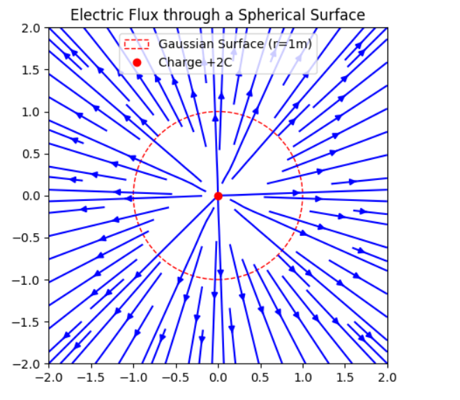

### 1. Gauss's Law
**Problem:** A point charge of $+2$ $C$ is located at the origin. Calculate the electric flux through a spherical surface of radius $1$ $m$ centered at the origin.

**Solution:**
Using Gauss's Law:
$$\Phi_E = \frac{Q_{enclosed}}{\epsilon_0}$$
Given $Q = 2$ $C$ and $\epsilon_0 \approx 8.854 \times 10^{-12}$ $F/m$:
$$\Phi_E = \frac{2}{8.854 \times 10^{-12}} \approx 2.26 \times 10^{11} \text{ V} \cdot \text{m}$$

