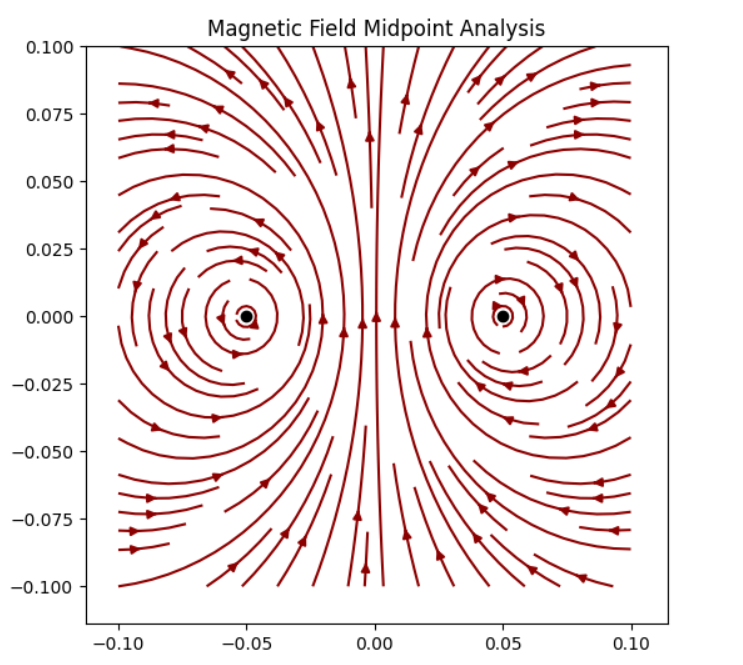

### 2. Ampere's Law
**Problem:** Two long, parallel wires are $10$ $cm$ apart and carry currents of $5$ $A$ in opposite directions. Calculate the magnetic field at the midpoint.

**Solution:**
At the midpoint ($r = 0.05$ $m$), the fields from both wires point in the same direction:
$$B_{total} = B_1 + B_2 = 2 \times \frac{\mu_0 I}{2 \pi r}$$
$$B_{total} = \frac{4\pi \times 10^{-7} \times 5}{\pi \times 0.05} = 4 \times 10^{-5} \text{ T}$$

