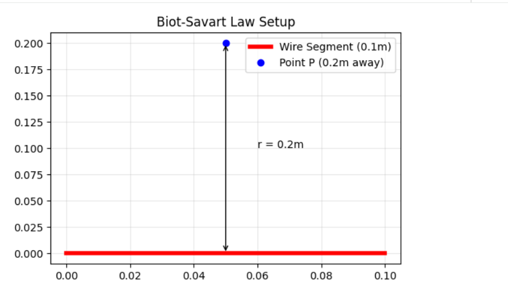

### 3. Biot-Savart Law
**Problem:** Segment length $0.1$ $m$, current $3$ $A$, distance $0.2$ $m$.

**Solution:**
$$B = \frac{\mu_0}{4\pi} \frac{I \Delta L \sin(\theta)}{r^2}$$
Assuming the segment is perpendicular ($\sin(90^\circ) = 1$):
$$B = 10^{-7} \times \frac{3 \times 0.1}{(0.2)^2} = 7.5 \times 10^{-7} \text{ T}$$

