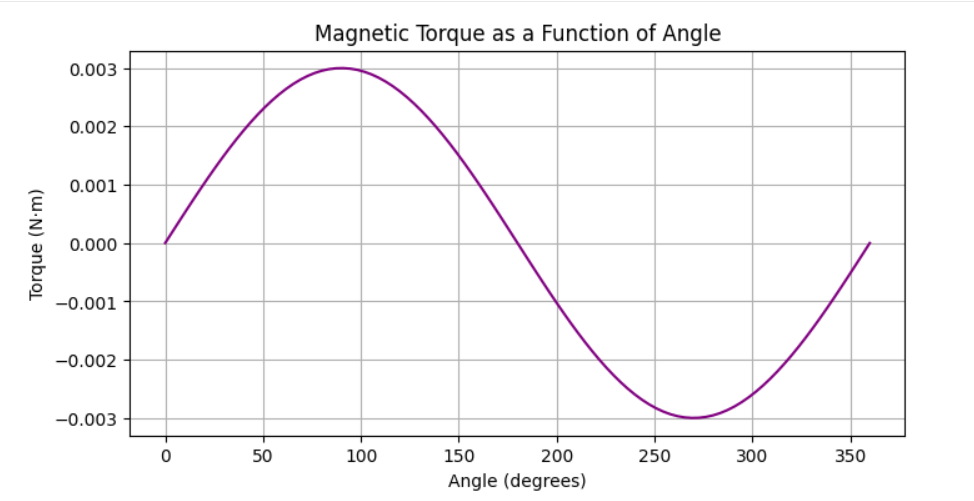

### 4. Magnetic Torque
**Problem:** Loop $10$ $cm$ $\times$ $5$ $cm$, $I = 2$ $A$, $B = 0.3$ $T$ parallel to the plane.

**Solution:**
$$\tau = N I A B \sin(\theta)$$
With $A = 0.005$ $m^2$ and $\theta = 90^\circ$:
$$\tau = 2 \times 0.005 \times 0.3 = 0.003 \text{ N} \cdot \text{m}$$

