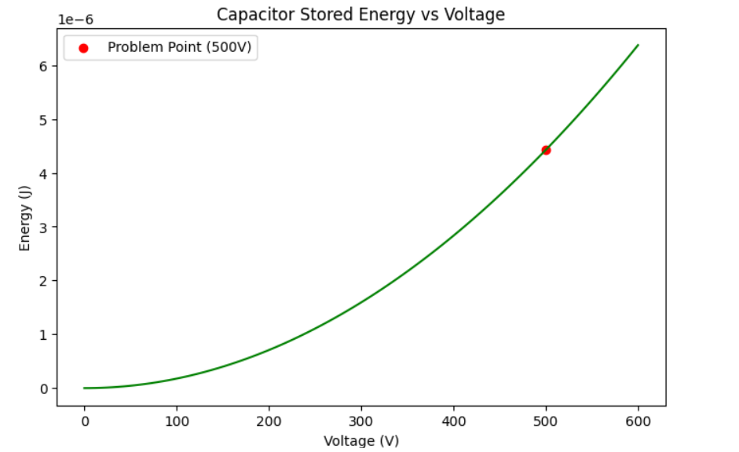

### 5. Energy Stored by Charge in a Capacitor
**Parameters:** $S = 0.02$ $m^2$, $d = 0.005$ $m$, $V = 500$ $V$.

**Solutions:**
1. **Capacitance:** $C = \frac{\epsilon_0 S}{d} \approx 3.54 \times 10^{-11} \text{ F}$
2. **Energy:** $W = \frac{1}{2} C V^2 \approx 4.43 \times 10^{-6} \text{ J}$
3. **Electric Field:** $E = \frac{V}{d} = 100,000 \text{ V/m}$
4. **Force:** $F = \frac{1}{2} C V E \approx 8.85 \times 10^{-4} \text{ N}$

