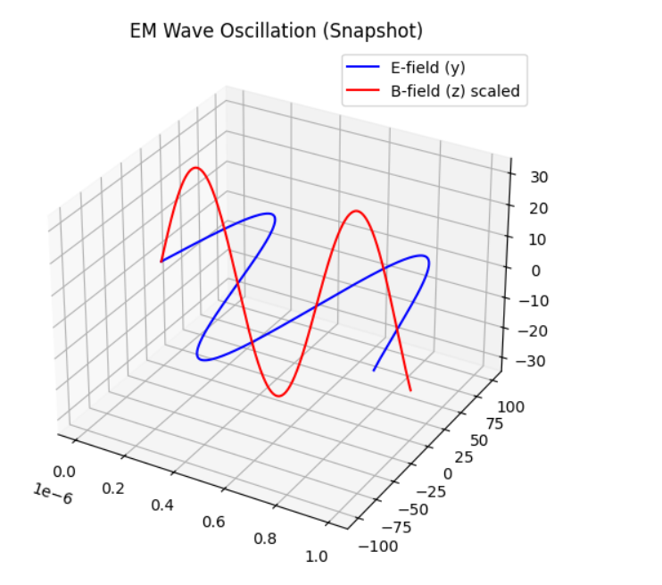

### 6. EM Wave Analysis
**Equation:** $E_y(x,t) = 100 \sin(10^7 x - \omega t)$ $V/m$.

**Solution:**
* **Direction:** Positive $x$-direction.
* **Wavelength:** $\lambda = \frac{2\pi}{10^7} \approx 6.28 \times 10^{-7} \text{ m}$
* **Angular Frequency:** $\omega = c \cdot k = 3 \times 10^{15} \text{ rad/s}$
* **Magnetic Field:** $B_z = \frac{E_0}{c} = 3.33 \times 10^{-7} \text{ T}$

