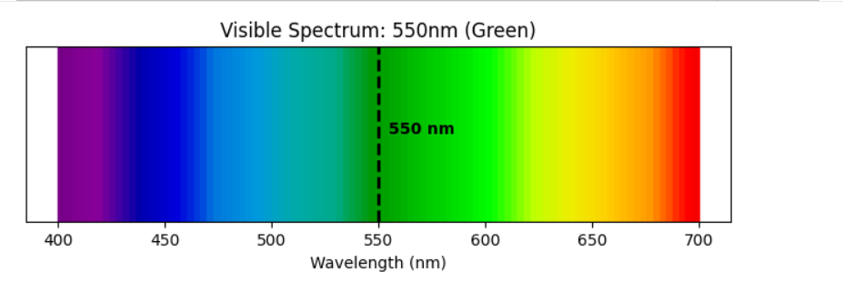

### 7. Wavelength and Frequency
**Problem:** The human eye is most sensitive to light with a wavelength of about $550$ $nm$. What color does this correspond to in the visible spectrum? What is the frequency of this light?

**Solution:**
1. **Color:** A wavelength of $550$ $nm$ falls directly in the **Green** portion of the visible spectrum.
2. **Frequency Calculation:**
   Using the wave equation $c = \lambda f$, where $c = 3 \times 10^8$ $m/s$:
   $$f = \frac{c}{\lambda} = \frac{3 \times 10^8}{550 \times 10^{-9}} \approx 5.45 \times 10^{14} \text{ Hz}$$

