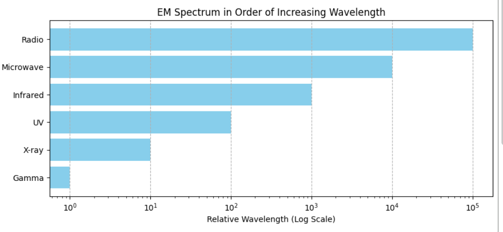

### 8. EM Spectrum
**Problem:** List the following types of electromagnetic radiation in order of increasing wavelength: Infrared, Ultraviolet, Microwaves, X-rays, Radio waves, Gamma rays.

**Solution:**
Increasing wavelength means moving from the highest energy (smallest wavelength) to the lowest energy (longest wavelength):
1. **Gamma rays** (Smallest $\lambda$)
2. **X-rays**
3. **Ultraviolet**
4. **Infrared**
5. **Microwaves**
6. **Radio waves** (Largest $\lambda$)

