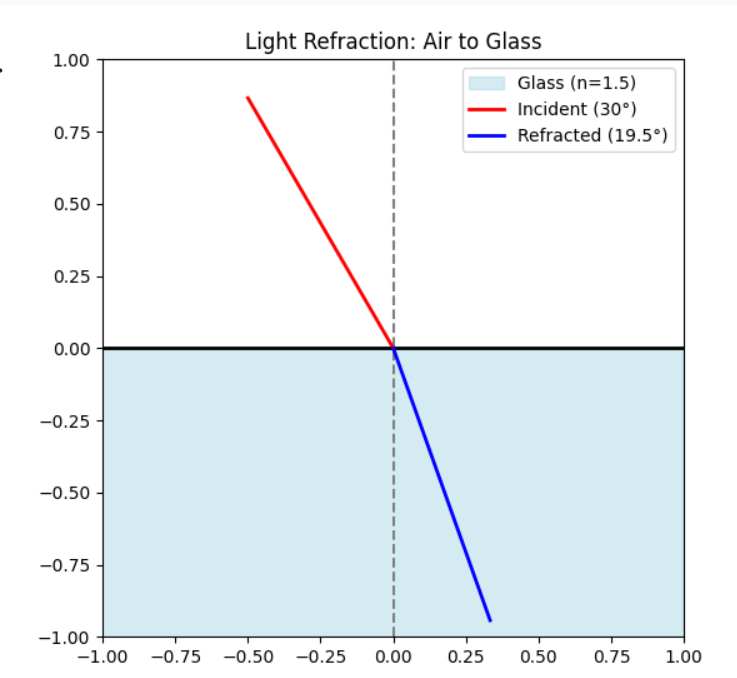

### 9. Refraction (Snell's Law)
**Problem:** A light ray travels from air ($n = 1.00$) into glass ($n = 1.50$). If the angle of incidence is $30^\circ$, what is the angle of refraction?

**Solution:**
Using Snell's Law:
$$n_1 \sin(\theta_1) = n_2 \sin(\theta_2)$$
Substituting the values ($n_1 = 1.0$, $n_2 = 1.5$, $\theta_1 = 30^\circ$):
$$1.0 \times \sin(30^\circ) = 1.5 \times \sin(\theta_2)$$
$$0.5 = 1.5 \sin(\theta_2)$$
$$\sin(\theta_2) = \frac{0.5}{1.5} \approx 0.333$$
$$\theta_2 = \arcsin(0.333) \approx 19.47^\circ$$

