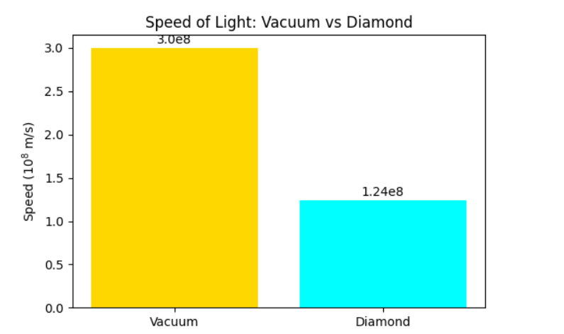

### 10. Speed of Light in Media
**Problem:** What is the speed of light in a diamond, which has an index of refraction $n = 2.42$?

**Solution:**
The speed of light in a medium is given by:
$$v = \frac{c}{n}$$
Where $c = 3 \times 10^8$ $m/s$ and $n = 2.42$:
$$v = \frac{3 \times 10^8}{2.42} \approx 1.24 \times 10^8 \text{ m/s}$$

